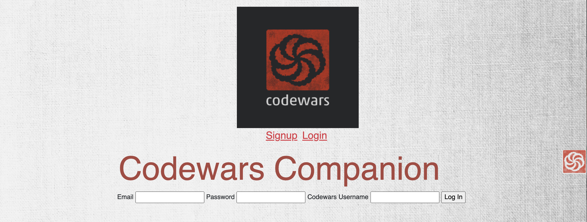
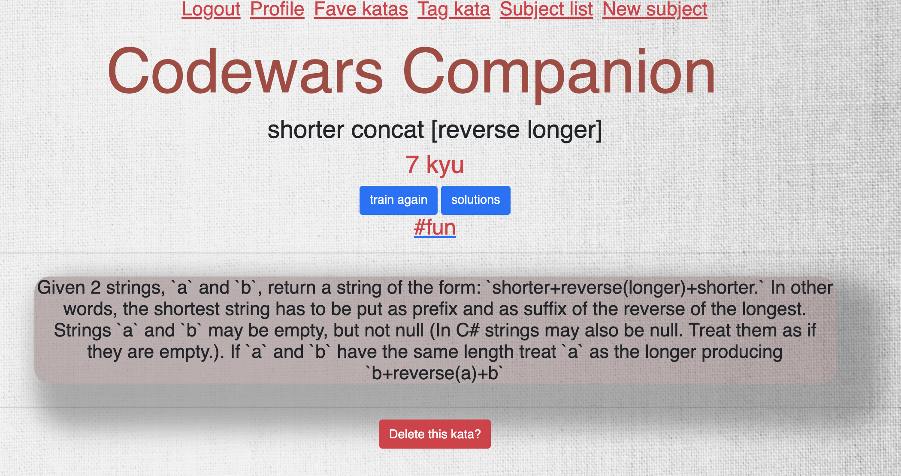

# Codewars Companion

Codewars is a great resource for practicing different coding languages and strategies, but it lacks any ability to organize your completed katas. Codewars Companion allows you to create tags and organize your completed katas by subject, thus saving you from having to dig through your archives for what you want.

Find it here: https://codewars-companion.herokuapp.com/ (make sure you're signed into your Codewars account before signing up or logging in to Codewars Companion)





## Technologies Used

- Node/Express with EJS templating and layouts
- Passport and Bcrypt
- Sequelize
- CSS Bootstrap
- Codewars API and Axios

## To Use

Fill in

## User Stories

The intended user is someone active on Codewars who wants a customizable way to organize their kata solutions.

- As a user, I want to...

  - be able to create a list of favorite katas.
  - be able to tag my codewars katas with a subject. For instance, I would like to group together all katas that focus on arrays.
  - be able to select a subject and see all katas associated with that subject.

## Models

#### A Note

Sequelize is unable to handle the word "kata," so I've used "exercise" in the model to avoid errors and kata wherever possible.

**Models**

| Model    | Schema                                               | Assocations                                                  |
| -------- | ---------------------------------------------------- | ------------------------------------------------------------ |
| Exercise | name, cw, userId,                                    | Belongs to users and belongs to many subjects                |
| Subject  | name                                                 | Belongs to many exercises.                                   |
| User     | name, email, password, codewars_username             | Has many exercises                                           |
| Tag      | content                                              | Belongs to many plants                                       |
| User     | name, email, password, zipcode, userImg, lastWatered | Belongs to many plants, has many journals, has many comments |

## Code Excerpts

1. This excerpt controls the initial API call to codewars to pull down all completed katas by the user. This information is then passed to the index.ejs page (second excerpt) to create a list of the kata.

```javascript
app.get("/", isLoggedIn, (req, res) => {
  const { id, codewars_username } = req.user.get();
  axios
    .get(
      `https://www.codewars.com/api/v1/users/${codewars_username}/code-challenges/completed?`
    )
    .then((response) => {
      let myKatasFull = response.data.data;
      res.render("index", { id, myKatasFull });
    });
});
```

2. This is the index.ejs page that creates the list of all completed kata. I've embedded a form within the forEach list to allow a user to add any kata to the "Fave kata" databse with the click of a button. I chained the split, slice, and join methods together to account for the fact that some kata names are of an unwieldy length.

```javascript
<h2 class="centered display-3">All my katas</h2>
<div class="backbox">
  <% myKatasFull.forEach( kata => { %>
  <div class="centered">
    <h3><%= kata.name %></h3>
    <form method="POST" action="/katas">
      <input hidden type="text" name="name" value="<%= kata.name %>" />
      <input hidden type="text" name="cw" value="<%= kata.id %>" />
      <input hidden type="integer" name="userId" value="<%= id %>" />
      <button class="btn btn-secondary italic" type="submit">
        Add "<%= kata.name.split(' ').slice(0,3).join(' ') %>" to Database
      </button>
    </form>

    <% })%>
  </div>
</div>
```

3. This excerpt features the second API call to Codewars, this time using a different path (Codewars documentation describes their API as "minimal and inconsistent. It was never actively developed."). This route uses the join table between katas and subjects to pass along information about what subject a specific kata has been tagged with.

```javascript
router.get("/:id", isLoggedIn, (req, res) => {
  db.exercise
    .findOne({
      where: { id: req.params.id },
      include: [db.subject],
    })
    .then((kata) => {
      if (kata !== null) {
        axios
          .get(`https://www.codewars.com/api/v1/code-challenges/${kata.cw}`)
          .then((kataRefetch) => {
            const rank = kataRefetch.data.rank;
            const description = kataRefetch.data.description;
            const cw = kataRefetch.data.id;
            const name = kataRefetch.data.name;
            res.render("katas/show", {
              rank: rank,
              description: description,
              name: name,
              cw: cw,
              kata: kata,
            });
          })
          .catch((error) => {
            console.log(error);
            res.status(400).render("404");
          });
      }
    });
});
```

4. This is the view page for the route in the previous excerpt. As discussed in the Future Considerations section, it is currently hard-coded to serve JavaScript completions only (the first API call will pull down all completed challenges in all languages). I've limited the descriptions to 1500 characters as a way to curtail the extremely long ones. The form at the bottom of the page allows a user to delete the kata from the database if desired.

```javascript
<div class="centered container">
  <div>
    <h2><%= name %></h2>
  </div>
  <div>
    <h2 class="text-danger"><%= rank.name %></h2>
  </div>
  <div>
    <a
      class="btn btn-primary"
      target="_blank"
      href="http://www.codewars.com/kata/<%= cw %>/train/javascript"
      >train again</a
    >
    <a
      class="btn btn-primary"
      target="_blank"
      href="http://www.codewars.com/kata/<%= cw %>/solutions/javascript"
      >solutions</a
    >
  </div>
  <div>
    <% kata.subjects.forEach(s => { %>
    <a href="/subjects/<%=s.id%>">
      <h3 class="text-danger">#<%= s.name %></h3></a
    >
    <% }) %>
    <hr />
    <div class="backbox"><h4><%= description.slice(0, 1500).trim() %></h4></div>
  </div>
  <hr />
  <form action="/katas/<%=kata.id %>?_method=DELETE" method="POST">
    <button type="submit" class="btn btn-danger">Delete this kata?</button>
  </form>
</div>
```

### Known Issues

- The subject model needs a userId and the code should be updated so that subjects.
- The user model should have a "has many" association with subjects.
- The code doesn't have built-in protocols to prevent duplicates in all cases.
- Id numbers don't seem to restart with new users but instead continue to increase.

### Future Considerations

(in no particular order)

- Simplify the "Tag kata" process.
- Allow multiple tags on a kata.
- Toggle between coding languages. The API call currently pulls down all solved challenges, but the "more info", "train again", and "solutions" links are all specific to JavaScript.
- Pull down solutions to the page instead of linking to them.
- Possibly account for the use of markdown that appears in some of the kata descriptions.
